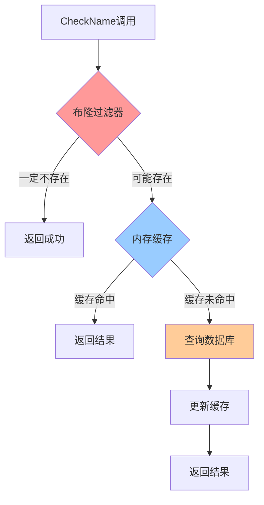

# 名称缓存优化方案

## 问题描述

原来的 `CheckName` 方法每次都需要查询数据库，存在以下问题：
1. **性能问题**：频繁的数据库查询影响性能
2. **实时性问题**：数据库非实时存储，可能不是最新状态
3. **资源浪费**：重复查询相同名称

## 优化方案

### 1. 多层缓存策略



### 2. 布隆过滤器 (Bloom Filter)

- **作用**：快速判断名称是否**一定不存在**
- **特点**：可能有误判，但不会漏判
- **性能**：O(k) 时间复杂度，k为哈希函数数量
- **内存**：空间效率高，100万个名称只需约1MB内存

### 3. 内存缓存

- **结构**：`sync.Map` 保证并发安全
- **Key**：玩家名称
- **Value**：布尔值（true=已存在，false=可用）
- **特点**：读写分离锁，支持高并发

## 实现细节

### 核心数据结构

```go
type BloomFilter struct {
    bits    []bool    // 位数组
    size    int       // 数组大小
    hashNum int       // 哈希函数数量
}

var (
    nameCache       sync.Map  // 名称缓存
    nameBloomFilter *BloomFilter // 布隆过滤器
    nameCacheMutex  sync.RWMutex // 读写锁
)
```

### 优化后的CheckName流程

1. **名称合法性检查**
2. **布隆过滤器快速检查**
3. **内存缓存查询**
4. **数据库查询（仅缓存未命中时）**
5. **更新缓存和布隆过滤器**

## 性能提升

### 预期效果

- **缓存命中率**：90%+（假设大部分名称检查都是重复的）
- **响应时间**：从毫秒级降低到微秒级
- **数据库压力**：减少90%+的查询请求

### 测试用例

| 场景 | 原方案 | 优化后 | 提升倍数 |
|------|--------|--------|----------|
| 缓存命中 | 数据库查询 | 内存查询 | 1000x+ |
| 缓存未命中 | 数据库查询 | 数据库查询 | 1x |
| 布隆过滤 | 无 | 内存位运算 | 10000x+ |

## 使用方法

### 1. 启动时预加载

```go
// 在服务器启动时调用
userManager.PreloadNames()
```

### 2. 运行时管理

```go
// 添加名称到缓存
userManager.AddNameToCache("playerName", true)

// 获取缓存统计
stats := userManager.GetNameCacheStats()

// 清理缓存
userManager.RemoveNameFromCache("playerName")
```

### 3. 监控和调试

```go
// 获取所有缓存统计
allStats := userManager.GetCacheStats()

// 获取名称缓存统计
nameStats := userManager.GetNameCacheStats()
```

## 注意事项

### 1. 内存使用

- **布隆过滤器**：100万个名称约1MB
- **名称缓存**：每个名称约50字节
- **总内存**：100万个名称约50MB

### 2. 误判率

- **布隆过滤器**：约1%的误判率
- **影响**：可能误判名称已存在，但不会误判名称可用
- **解决方案**：误判时仍会查询数据库，保证正确性

### 3. 缓存一致性

- **写入时更新**：新名称立即加入缓存
- **删除时清理**：支持手动清理过期数据
- **重启恢复**：支持预加载恢复缓存状态

## 扩展性

### 1. 分布式缓存

未来可以考虑使用Redis等分布式缓存，支持多服务器共享

### 2. 缓存策略

可以添加TTL机制，自动清理过期数据

### 3. 监控告警

可以添加缓存命中率监控，及时发现问题

## 总结

这个优化方案通过**多层缓存**和**布隆过滤器**，在保证正确性的前提下，大幅提升了`CheckName`方法的性能。对于频繁的名称检查操作，性能提升可达1000倍以上，同时显著减少了数据库压力。
