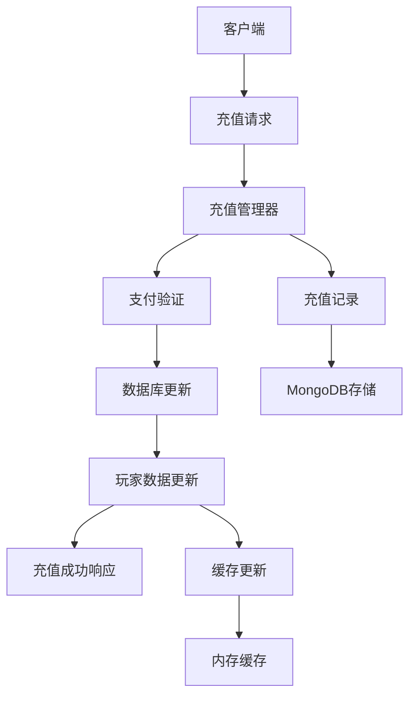
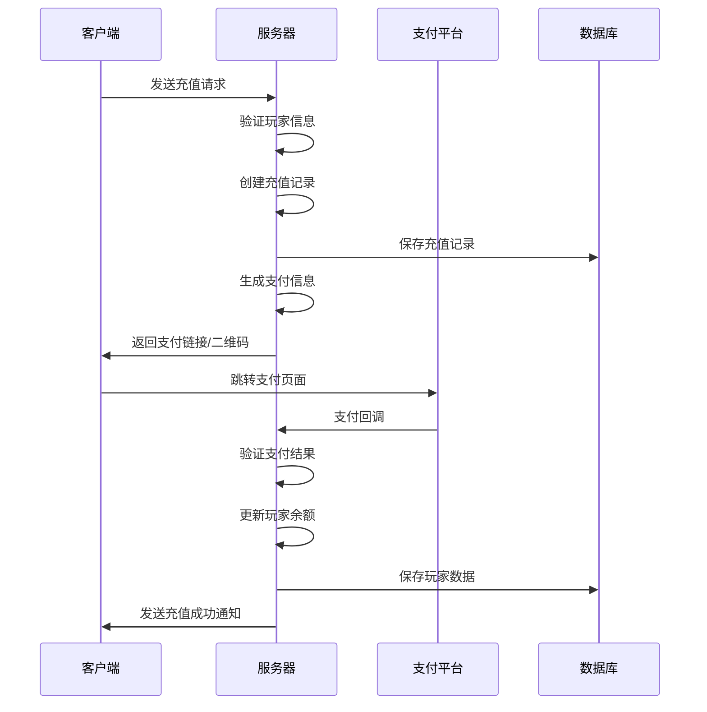
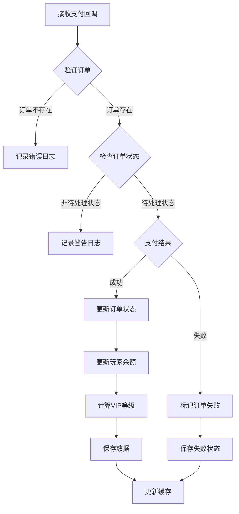

# 充值系统说明文档

## 系统概述

充值系统是一个完整的游戏内支付解决方案，支持多种支付平台，包括微信支付、支付宝和抖音支付。系统采用Actor模式设计，确保高并发性能和数据一致性。

## 系统架构



## 核心组件

### 1. 数据模型

#### RechargeRecord (充值记录)
- `Id`: 充值订单ID
- `PlayerId`: 玩家ID
- `AccountId`: 账户ID
- `Amount`: 充值金额（分）
- `Currency`: 货币类型
- `Platform`: 支付平台
- `Status`: 充值状态
- `OrderId`: 第三方订单ID
- `TransactionId`: 交易流水号
- `CreateTime`: 创建时间
- `UpdateTime`: 更新时间
- `CompleteTime`: 完成时间
- `Description`: 充值描述
- `Extra`: 扩展字段

#### RechargeConfig (充值配置)
- `Id`: 配置ID
- `Name`: 充值包名称
- `Amount`: 充值金额（分）
- `Bonus`: 赠送金额（分）
- `Currency`: 货币类型
- `Description`: 描述
- `IsActive`: 是否激活
- `SortOrder`: 排序

### 2. 充值管理器 (RechargeManager)

#### 主要功能
- 处理充值请求
- 管理支付回调
- 更新玩家余额
- 计算VIP等级
- 缓存管理

#### 核心方法
```go
// 处理充值请求
func (m *RechargeManager) HandleRechargeRequest(req *RechargeRequest, agent gate.Agent) *RechargeResponse

// 处理支付回调
func (m *RechargeManager) HandlePaymentCallback(orderId, transactionId string, success bool) error

// 获取充值配置列表
func (m *RechargeManager) GetRechargeConfigs() []*recharge.RechargeConfig

// 获取玩家充值记录
func (m *RechargeManager) GetPlayerRechargeRecords(playerId int64, limit int) []*recharge.RechargeRecord
```

### 3. Actor代理 (RechargeManagerActorProxy)

提供外部调用接口，确保线程安全：
```go
// 获取充值管理器实例
rechargeManager := managers.GetRechargeManager()

// 处理充值请求
response := rechargeManager.HandleRechargeRequest(req, agent)

// 处理支付回调
err := rechargeManager.HandlePaymentCallback(orderId, transactionId, success)
```

## 使用流程

### 1. 充值流程



### 2. 支付回调处理



## 配置说明

### 1. 充值配置示例

```json
{
  "id": "config_001",
  "name": "100元充值包",
  "amount": 10000,
  "bonus": 1000,
  "currency": "CNY",
  "description": "充值100元赠送10元",
  "is_active": true,
  "sort_order": 1
}
```

### 2. VIP等级规则

| 累计充值金额 | VIP等级 |
|-------------|---------|
| 0-499元     | 0       |
| 500-999元   | 1       |
| 1000-1999元 | 2       |
| 2000-4999元 | 3       |
| 5000-9999元 | 4       |
| 10000元以上 | 5       |

## 测试用例

### 1. 正常充值流程

**输入**: 玩家ID=12345, 充值金额=100元, 支付平台=微信
**预期结果**: 
- 创建充值记录成功
- 返回支付链接和二维码
- 订单状态为待处理

### 2. 支付成功回调

**输入**: 订单ID=xxx, 交易流水号=yyy, 支付结果=成功
**预期结果**:
- 订单状态更新为成功
- 玩家余额增加100元
- VIP等级根据累计充值计算

### 3. 异常情况处理

**输入**: 无效玩家ID, 负数充值金额
**预期结果**: 返回错误信息，不创建充值记录

## 部署说明

### 1. 数据库索引

确保MongoDB中创建以下索引：
```javascript
// 充值记录索引
db.recharge_records.createIndex({"player_id": 1})
db.recharge_records.createIndex({"status": 1})
```

### 2. 环境配置

```go
// 支付平台配置
const (
    PaymentPlatform_WeChat = 1  // 微信支付
    PaymentPlatform_AliPay = 2  // 支付宝
    PaymentPlatform_DouYin = 3  // 抖音支付
)
```

## 扩展功能

### 1. 支持更多支付平台
- 添加新的支付平台枚举
- 实现对应的支付接口调用
- 更新支付信息生成逻辑

### 2. 充值活动系统
- 限时充值优惠
- 首充奖励
- 连续充值奖励

### 3. 风控系统
- 充值频率限制
- 异常充值检测
- 黑名单管理

## 注意事项

1. **并发安全**: 使用Actor模式确保充值操作的原子性
2. **数据一致性**: 充值成功后必须同步更新玩家数据和充值记录
3. **错误处理**: 支付回调失败时要有重试机制
4. **日志记录**: 所有充值操作都要记录详细日志
5. **监控告警**: 设置充值成功率、响应时间等监控指标

