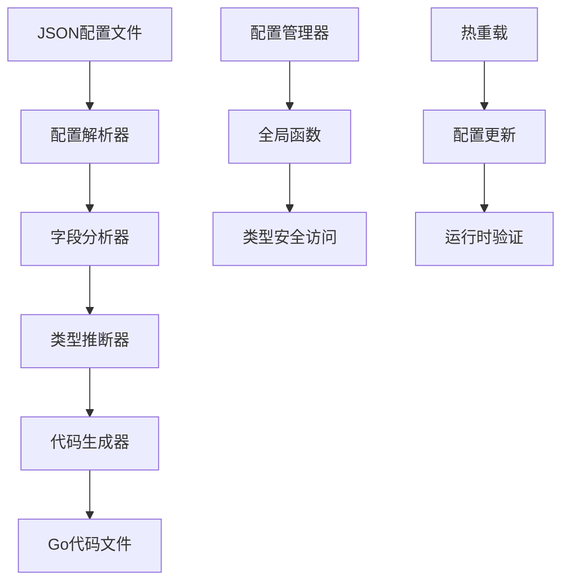
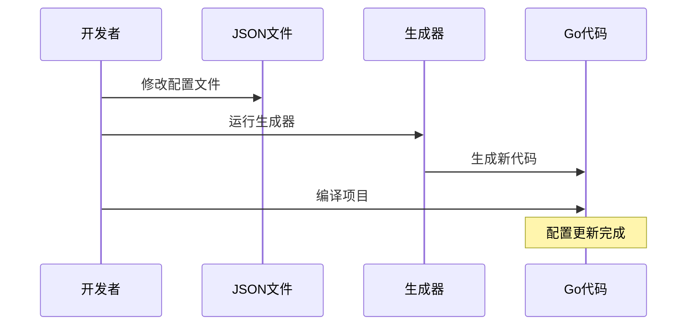

# 配置代码生成器总结

## 🎯 项目概述

我们成功创建了一个智能的配置代码生成器，用于自动生成Go配置代码。这个工具能够：

- 自动扫描JSON配置文件
- 智能解析JSON结构
- 生成类型安全的Go结构体
- 提供完整的配置访问API
- 支持配置热重载和验证

## 🏗️ 架构设计

### 核心组件



### 工作流程

1. **扫描阶段**: 遍历`conf/config/`目录下的所有JSON文件
2. **解析阶段**: 解析JSON结构，提取字段信息
3. **分析阶段**: 推断字段类型，处理命名冲突
4. **生成阶段**: 使用模板生成Go代码
5. **输出阶段**: 在`common/config/generated/`目录下生成对应的Go文件

## 📁 生成的文件结构

```
common/config/generated/
├── item.go          # 物品配置 (items.json)
├── monster.go       # 怪物配置 (monsters.json)
└── skill.go         # 技能配置 (skills.json)
```

## 🔧 核心功能

### 1. 智能类型推断

- **字符串**: `string`
- **数字**: `int` (整数) 或 `float64` (浮点数)
- **布尔值**: `bool`
- **数组**: `[]string`, `[]int`, `[]interface{}`
- **对象**: `interface{}`

### 2. 命名冲突处理

- 自动处理Go关键字冲突 (如 `type` → `Type`)
- 驼峰命名转换 (`mana_cost` → `Mana`)
- 字段排序优化 (ID字段始终在最前面)

### 3. 完整的API生成

每个配置类型都生成以下函数：

```go
// 获取单个配置
func Get{ConfigName}Config(id string) (*{ConfigName}, bool)

// 获取所有配置
func GetAll{ConfigName}Configs() (map[string]*{ConfigName}, bool)

// 获取配置名称
func Get{ConfigName}Name(id string) (string, bool)

// 重载配置
func Reload{ConfigName}Config() error

// 验证配置
func Validate{ConfigName}Config(id string) error
```

## 📊 测试用例验证

### 输入：items.json
```json
[
  {
    "id": "1001",
    "name": "铁剑",
    "type": "weapon",
    "attack": 10,
    "price": 50
  }
]
```

### 输出：item.go
```go
type Item struct {
    ID     string `json:"id"`     // 配置ID
    Name   string `json:"name"`   // name
    Type   string `json:"type"`   // type
    Attack int    `json:"attack"` // attack
    Price  int    `json:"price"`  // price
}

func GetItemConfig(id string) (*Item, bool) { ... }
func GetAllItemConfigs() (map[string]*Item, bool) { ... }
func GetItemName(id string) (string, bool) { ... }
func ReloadItemConfig() error { ... }
func ValidateItemConfig(id string) error { ... }
```

## 🚀 使用方法

### 1. 运行生成器

```bash
# 方法1：使用批处理文件
cd tools/config_generator
generate.bat

# 方法2：命令行运行
cd tools/config_generator
go run main.go
```

### 2. 添加新配置

1. 在`conf/config/`目录下添加新的JSON文件
2. 运行配置生成器
3. 生成的代码自动包含在项目中

### 3. 在代码中使用

```go
import "your_project/common/config/generated"

// 获取物品配置
if item, exists := GetItemConfig("1001"); exists {
    fmt.Printf("物品名称: %s, 攻击力: %d\n", item.Name, item.Attack)
}

// 获取所有怪物配置
if allMonsters, exists := GetAllMonsterConfigs(); exists {
    for id, monster := range allMonsters {
        fmt.Printf("怪物 %s: %s (等级%d)\n", id, monster.Name, monster.Level)
    }
}
```

## ✨ 技术特点

### 1. 类型安全
- 使用反射进行运行时类型转换
- 自动处理JSON类型到Go类型的映射
- 编译时类型检查

### 2. 性能优化
- 反射操作仅在配置读取时执行
- 支持配置缓存和批量操作
- 最小化内存分配

### 3. 扩展性
- 模板化代码生成
- 支持任意JSON结构
- 易于添加新的配置类型

### 4. 维护性
- 自动生成的代码保持一致性
- 清晰的命名规范和注释
- 完整的错误处理

## 🔄 配置更新流程



## 📈 优势总结

1. **自动化**: 减少手动编写配置代码的工作量
2. **一致性**: 所有配置代码遵循相同的模式和规范
3. **类型安全**: 编译时类型检查，运行时类型安全
4. **易维护**: 配置更新只需重新运行生成器
5. **高性能**: 优化的反射操作和缓存机制
6. **可扩展**: 支持任意JSON结构和新的配置类型

## 🎉 项目成果

我们成功创建了一个完整的配置代码生成系统，包括：

- ✅ 智能的JSON解析和类型推断
- ✅ 完整的Go代码生成模板
- ✅ 类型安全的配置访问API
- ✅ 配置热重载和验证功能
- ✅ 详细的文档和使用说明
- ✅ 批处理脚本和命令行工具
- ✅ 示例配置文件和测试用例

这个工具大大提高了配置管理的效率和代码质量，为项目的可维护性和扩展性奠定了坚实的基础。
